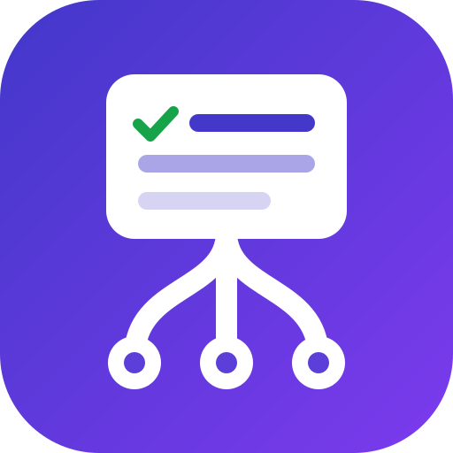

<p align="center">
  
</p>

<h1 align="center">project-memory</h1>

<p align="center">
  A plan, a task board, a decision log and a session handoff for every git repository —<br>
  kept by Claude Code itself, shared by all your worktrees, local by default.
</p>

<p align="center"><b>English</b> · <a href="README.ru.md">Русский</a></p>

---

## Why

Claude Code forgets between sessions. On anything longer than one sitting that costs you:

- every new session starts with "where did we stop?" and a re-read of the repository;
- the reasons behind earlier choices are gone, so settled questions get argued again;
- two worktrees of the same repo know nothing about each other and can pick up the same work;
- a plan written by another tool (superpowers, gstack, plan mode) drifts away from what is actually done.

project-memory keeps one small board per repository and puts a 40-line summary of it into the start of
every session. Claude keeps the board current on its own: it creates tasks, moves statuses, logs what it
did and what comes next, and records decisions with what was rejected.

## Install

Requires Node ≥ 20 and git. Works on macOS, Linux and Windows. No dependencies.

```
/plugin marketplace add ZizzX/claude-project-memory
/plugin install project-memory@project-memory
```

Restart Claude Code (a new process, not `/clear`) so the hooks load.

**Update:** when a newer version is already on this machine or has been released, the session summary says so:

```
[pm] update available: 0.3.0 → 0.3.1 — say "update the plugin", "later", "never" or "update it yourself"
```

Say **"update the plugin"** and Claude installs it and tells you to restart; **"later"** snoozes it for
7 days (a newer release than that one still speaks up), **"never"** stops the notice for good, and
**"update it yourself, do not ask"** lets Claude install new versions on its own from then on — it still
reports what landed. Your answer is stored in `git config --global`: `pm.updateNotify` (`ask` | `auto` |
`never`) and `pm.updateSnoozeUntil`. Nothing is installed without your yes.

By hand it is:

```
/plugin marketplace update project-memory
/plugin update project-memory@project-memory
```

Then restart Claude Code again.

The check costs two local file reads: the copy of the marketplace Claude Code already keeps. Once a day
it also reads the released `plugin.json` over HTTPS, in a background process that never delays a session —
turn that off with `git config --global pm.updateCheckNetwork false`; the local check keeps working.

## Quick start

1. Open a repository and start real work: "let's build the CSV import". For non-trivial, multi-step work
   Claude creates the board (`pm init`), fills `PLAN.md` and imports existing plans. You can also say
   "create a board".
2. Ask **"break it down"**. Claude creates tasks with order and dependencies, and links a detailed plan.
3. Ask **"what's next?"**. Claude claims the first ready task and writes down how it understands it.
4. Work as usual. When you stop, say **"we're done"**: Claude logs what was done and the exact next step.
5. `/clear` or come back tomorrow in any worktree. The session opens with the summary and carries on.

Open `board.html` (the link is in the summary) for a kanban view that refreshes every 10 seconds.

## Four ways it is used

| Way | What it is | Who uses it |
|---|---|---|
| **Hooks** | Run automatically: summary at session start, reminders, safety notes | nobody — they just run |
| **Phrases** | Plain language in the chat, like "what's next?" | you |
| **`/pm`** (also `/project-memory:pm`) | The skill: the protocol Claude follows for every situation | Claude; you, to read the rules |
| **`pm` CLI** | The commands that change the board | Claude; you, when you want to |

To see every command and phrase at once:

```
node ~/.claude/plugins/marketplaces/project-memory/scripts/pm.mjs help
```

Handy alias: `alias pm='node ~/.claude/plugins/marketplaces/project-memory/scripts/pm.mjs'`.
Run it from inside the project. The session summary also prints the exact CLI path it uses.

## What to say

| You say | Claude does |
|---|---|
| "what's next?", "take the next one" | `pm ready`, claims the first task of this worktree's direction, writes `## Understanding` first |
| "break it down" | Creates tasks with `--order`, `--deps`, `--epic`; puts detail in a plan file and links it |
| "remember …" | Puts it in exactly one place: a decision, auto-memory, or the task's `## Understanding` |
| "waiting for …" | `status=waiting` with the reason; the task leaves Ready |
| "we're done", "continue in a new session" | Logs `did` / `next` on every active task of this worktree, updates focus |
| "the plan changes" | Edits `PLAN.md`, adds a Changelog line, records a decision |
| "undo that", "undo the board change" | Reverts that change of the board itself with git |
| "undo the code of T-007", "remove the changes of T-007" | Shows the `undo:` block of `pm show T-007` with its risks, waits for your yes, then reverts the task's commits in a new undo task on a `revert/T-007` branch |
| "go back to the state before T-007" | Offers `git switch -c before/T-007 <base>` first — nothing is lost; the destructive ways only if you ask for them |
| "enable board sync", "connect the board" | Shows where the board would be pushed and waits for your yes |
| "update the plugin", "later", "never", "I'll do it myself" | Answers the `[pm] update available` line: installs the new version, snoozes it for 7 days, silences it, or just shows you the commands |
| "update it yourself, do not ask" | `pm.updateNotify=auto` — from then on Claude installs new versions without asking and reports what landed |

"undo T-007" on its own is ambiguous, so Claude asks which one you mean: the board change, the code of the
task, or the state the repository was in before it. The plugin never runs a destructive git command on your
code by itself — it prints the exact command and waits.

After you open an MR/PR for a task, say so or run `pm set T-NNN pr=<url>`: `pm show` then reads its state,
merge SHA and author, and the undo block targets the merge commit instead of the individual commits.

Russian phrases work too: «что дальше», «бери следующую», «разбей», «запомни», «закончили»,
«продолжим в новой сессии», «план меняется», «ждём», «отмени правку доски», «откати код T-007»,
«вернись к состоянию до T-007», «включи синхронизацию доски», «подключи доску», «обнови плагин»,
«позже», «не напоминай», «обновляй сам».

Every turn that changed the board ends with one line in your language, such as
`board: T-003 → done · new T-007 "data migration" (after T-005) · D-004`.

## The session summary

```
[pm] my-app · epic APP-12 · focus: import pipeline, parser done · board: file:///…/pm/board.html
Your worktree (feature-csv):
  T-003 CSV import [in_progress] → next: handle empty rows (2026-09-12, feature-csv)
Elsewhere: T-008 Export to XLSX @ feature-export
Ready: T-004 validation · T-006 export · +2 in other epics (pm ready --all)
Waiting: T-005 ← answer about date format
Epics: APP-12 4/6 · APP-15 2/2
Decisions: D-004 Store board outside branches · D-003 Own format
CLI: node "…/scripts/pm.mjs" <command>
Rules: …
```

| Line | Meaning |
|---|---|
| header | project, this worktree's epic, its focus line from `PLAN.md`, link to the board |
| Your worktree | open tasks claimed here, with the last logged next step |
| Elsewhere | tasks in progress in other worktrees — do not take them |
| Ready | `todo` tasks whose dependencies are all done, for this worktree's epic |
| Waiting | tasks blocked on something outside the board, and what |
| Epics | open / total per direction |
| Decisions | the three most recent |

The summary never exceeds 40 lines. Detail stays in the files and is read only when needed.

## Several directions in one repository: epics

The board is one per repository, so unrelated work in different worktrees shares it. Give each direction
an **epic** — a free key on its tasks, usually the Jira/Linear epic or ticket key, or a short slug:

```
pm task new --title "Parser" --epic APP-12 --links docs/plans/csv-import.md
```

- **A worktree's epic is what its claimed tasks carry**, never the branch or directory name. The summary,
  `pm ready` and the focus line are narrowed to it.
- **A task without an epic is repo-wide** and shows in every direction. `--epic ""` creates one on purpose.
- **A fresh worktree** that has claimed nothing gets a summary with one ready task per epic, tagged
  `(APP-12)`, and no foreign focus line. `pm ready` there lists every ready task with its tag. The worktree
  starts its own direction with `pm task new --epic <KEY>`.
- **Dependencies may cross epics.** A task is ready when its dependencies are done, wherever they live.
- **`PLAN.md` focus is one line per epic:** `- APP-12: parser done, validation next`.
- **Closing is automatic.** When no task of an epic is open any more, its cards leave the columns and
  fold into one `Archive` line with the number of done tasks. An epic whose tasks were all dropped just
  disappears. There is nothing to archive by hand.
- `pm epics` lists every direction with open/total and its focus line.

Boards without epics behave exactly as they did before epics existed.

**Mapping a tracker epic.** Use the tracker's epic key as the board epic. One board task is one branch or
merge request: split a big ticket into several tasks, fold several small tickets into one. Put ticket keys
in titles and tracker links in `--links`. The tracker stays the team's view; the board is Claude's working
memory for that work.

## When to use it — and when not

Put work on the board when **any** of these is true:

- it will outlive the current session (`/clear`, tomorrow, next week);
- it will continue in another worktree or on another machine;
- it waits on something outside the code: a review, an answer, another team.

Typical shapes:

| Work | On the board |
|---|---|
| A feature over several merge requests | one epic, 5–15 tasks, a linked plan |
| One ticket, one merge request | one task, epic = ticket key or none |
| A refactoring in several passes | an epic slug like `refactor-forms` |
| A one-session fix, a review, a question | nothing; answer the Stop reminder "nothing to track" |

If a small fix spills into a second session, file the task then. It is cheaper than filing ahead.

## Commands

| Command | What it does |
|---|---|
| `pm init` | Create the board for this repository |
| `pm task new --title T [--order N] [--deps T-001,T-002] [--milestone M] [--epic KEY] [--links a,b]` | Create a task. Without `--epic` it inherits this worktree's epic |
| `pm set T-003 key=value …` | Change fields: `status`, `order`, `depends_on`, `waiting_on`, `milestone`, `epic`, `links`, `title`, `pr` (the MR/PR URL `pm show` reads) |
| `pm claim T-003` | Attach this worktree to the task and set `in_progress` |
| `pm log T-003 --did "…" --next "…"` | Append a work log entry |
| `pm show T-003` | What the task file does not say: branch, MR/PR state, timeline, commits, decisions, dependents, and the `undo:` block — the exact `git revert` / `git switch -c before/…` commands and their risks. Read-only |
| `pm decision --title T --why W --rejected R [--tasks T-001]` | Record a decision |
| `pm ready [--epic KEY \| --all]` | Ready tasks of this worktree's epic, of one epic, or all. Without an epic of its own the worktree gets all, tagged |
| `pm epics` | Every epic: open/total and its focus line |
| `pm prefix [KEY]` | Show or set the task id prefix, e.g. `PM` → `PM-051`, for branches like `feat/PM-051/slug`. Stored in the board (`config.json`), so synced machines share it. Existing tasks keep their ids; the number continues |
| `pm validate` | Check ids, statuses, `waiting` without a reason, unknown or dropped dependencies, cycles |
| `pm board` | Redraw `BOARD.md` and `board.html`, print the path |
| `pm summary` | Print the session summary for this worktree |
| `pm scan` | List plan files in `docs/superpowers/plans`, `docs/superpowers/specs`, `docs/designs`, `.dev-cycle/tasks` and gstack ceo-plans, with checkbox progress |
| `pm sync on [--remote url] [--yes]` · `pm sync off` · `pm sync` | Opt-in sync across machines |
| `pm update [later \| never \| auto \| ask]` | The update notice: current and available version, the two commands to install it, and how it behaves from now on |
| `pm help` | All of the above, plus the phrases. `--help` after any command shows the same |

Statuses: `todo`, `in_progress`, `waiting` (needs `waiting_on`), `done`, `dropped`.
"Blocked by another task" is a dependency, not a status.

## Hooks

| Event | What happens |
|---|---|
| **SessionStart** (startup, resume, clear, compact) | With sync on: commit, pull, check the memory link. Redraw the board, validate it, print the summary |
| **PostToolUse** (Write, Edit, MultiEdit, ExitPlanMode) | A file inside the board changed → redraw the views. A plan file was written → ask Claude to reconcile the board with it |
| **Stop** | Commit the board. If code changed but neither this worktree's tasks nor `PLAN.md` / `decisions.md` were touched for 20 minutes → ask Claude to log progress (at most once per 20 minutes) |
| **PreCompact**, **SessionEnd** | Append an automatic note (changed files, last commit) to this worktree's in-progress tasks and commit |

Plan files that trigger the reconcile nudge: `docs/superpowers/plans/`, `docs/superpowers/specs/`,
`docs/designs/`, `.claude/plans/`, `~/.gstack/projects/*/ceo-plans/`, `.dev-cycle/tasks/`.

Hooks never break a session: any error is swallowed, and the hook exits cleanly.

## Where things live

```
~/.claude/projects/<repo-key>/pm/          ($CLAUDE_CONFIG_DIR/projects/… if set)
├── PLAN.md          goal, milestones, current focus (one line per epic), changelog
├── tasks/T-NNN.md   frontmatter + Goal, Understanding, Checklist, Log
├── decisions.md     append-only D-NNN entries: what, why, what was rejected
├── memory/          Claude Code auto-memory, only when sync is on
├── BOARD.md         generated view, never edit
└── board.html       generated kanban, refreshes itself
```

- **One board per repository.** The key comes from the git common directory, so every worktree of the
  repo shares it; branches do not.
- **It is a git repository** (branch `pm`). Every change is a commit, so any change can be reverted:
  `git -C <pm dir> log --oneline`, then `git -C <pm dir> revert <sha>`.
- **Layers of memory, each in one place:** auto-memory holds durable facts about the project;
  `decisions.md` holds why things are the way they are; a task file holds what and how for that work;
  `PLAN.md` holds where things stand. A direction's detailed plan is its own file, linked with `--links`.

A task file:

```markdown
---
id: T-003
title: CSV import
status: in_progress
order: 30
depends_on: [T-001]
waiting_on: ""
worktrees: [feature-csv]
milestone: M1
links: [docs/plans/csv-import.md]
updated: 2026-09-12
epic: APP-12
---
## Goal
## Understanding
## Checklist
## Log
- 2026-09-12 · feature-csv · did: tokenizer and header mapping · next: handle empty rows
```

## Sync across machines (opt-in)

Nothing leaves your machine until you enable sync for a project.

1. Say **"enable board sync"** (or run `pm sync on`). Claude shows the remote and branch and waits for yes.
2. The board is pushed to branch `pm` of the project's own remote. Claude Code's auto-memory for the
   project moves into the board and syncs with it.
3. Afterwards every board change is pushed in the background; each session start pulls first.
   If commits stay unpushed for over a day, the summary says so.
4. On another machine: install the plugin, open the project, say **"connect the board"**.

**Privacy.**

- If the project's repository is public, the board and memory become public. Use
  `pm sync on --remote <private-url>`.
- To sync the board but keep memory local: `git config pm.syncMemory false` **before** enabling sync.
- `pm sync off` stops syncing and keeps the local board. The remote branch stays until you delete it.

**Conflicts.** The summary shows `[pm] sync conflict in …`. Claude follows the protocol: runs `pm sync`,
merges the listed markdown files keeping both sides, and syncs again. Nothing is discarded.

## Working with other tools

- **Plan writers** (superpowers, gstack, plan mode, dev-cycle): write the detailed plan with them. When the
  file is saved, Claude adds coarse tasks to the board with a link to it and never copies its content.
  Items removed from the plan become `dropped`.
- **Other memory or resume tools** (checkpoints, context-save skills, memory MCP servers): consider turning
  them off once the board works for you, so "where did we stop?" has one answer.

## Troubleshooting

| Symptom | Fix |
|---|---|
| No summary at session start | The repo has no board yet. Start multi-step work or say "create a board" |
| `[pm] this repo has a shared board …` | Sync is on elsewhere. Say "connect the board" |
| Changes to the plugin do not show up | Fully restart Claude Code. Check `~/.claude/plugins/installed_plugins.json` for the version |
| Summary shows `focus: —` | This worktree has no epic yet, or `PLAN.md` has no line for it |
| Stop keeps asking to update the board | Log progress, claim a task, or answer "nothing to track" |
| `[pm] board problems: …` | Run `pm validate` and fix the listed tasks |
| A wrong board change | Say "undo that", or revert it with git in the board directory |
| Code of a task has to go | Say "undo the code of T-007": you get the exact commands and the risks before anything runs |

## Development

```
node --test              # run all tests
claude --plugin-dir .    # try the plugin from this checkout without installing
```

Releasing a change to an installed plugin:

1. Finish the change and run the tests.
2. **Bump `version` in `.claude-plugin/plugin.json` as the very last edit**, then commit and push.
   `plugin update` compares only the version. A background marketplace refresh can copy the working tree
   the moment the version changes, so a version bumped mid-work installs half-finished code.
3. Run the two update commands, then restart Claude Code.
4. Verify: the version in `~/.claude/plugins/installed_plugins.json`, and
   `diff -rq ~/.claude/plugins/cache/project-memory/project-memory/<version> .` shows only `.git`.

Design notes live in [`docs/superpowers/`](docs/superpowers/).

## License

MIT
